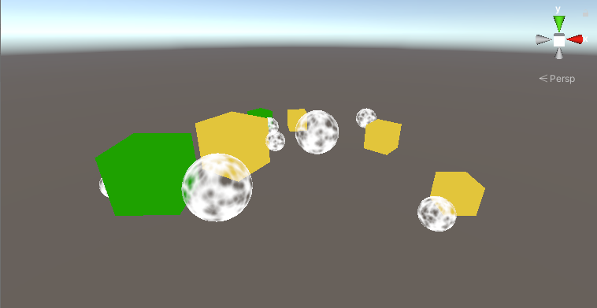
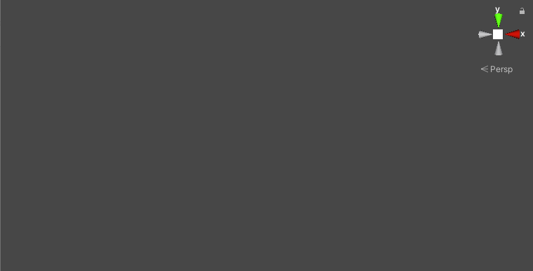
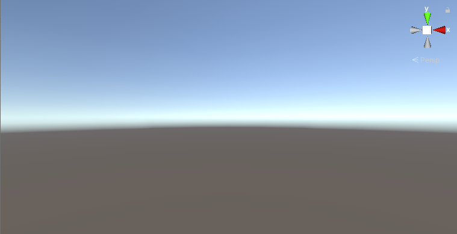
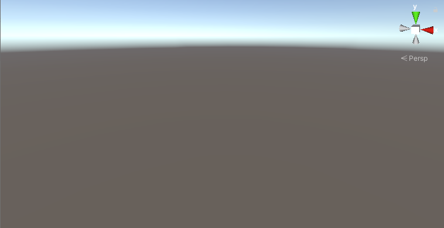
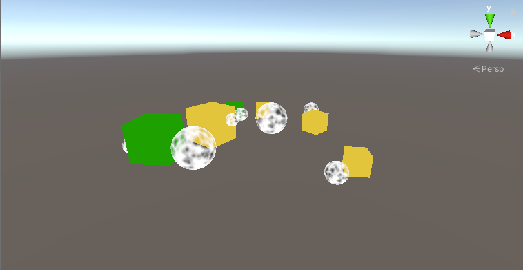
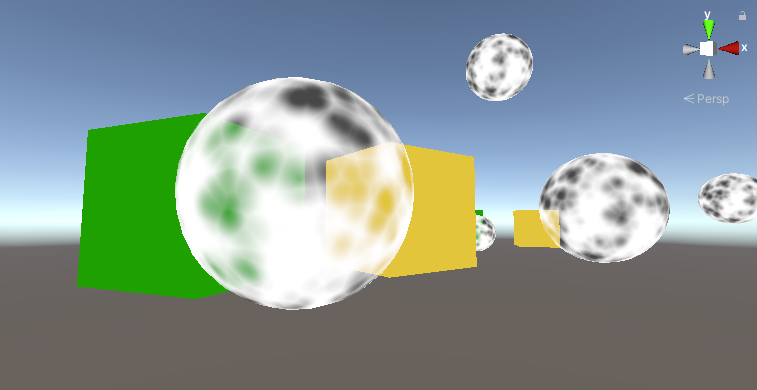
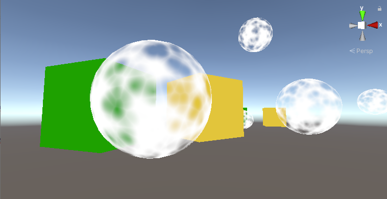

# 目的
SRPを1から触ってみたい！
URPやHDRPを読む足掛けがほしい！

なのでSRPで無から物体を簡単に描画するまで行っていきます

# Scriptable Render Piplineとは？
Unity2019からUnityのレンダリングパイプラインを開発者側でもいじれるように提供されている
URPやHDRPもSRPで記述されていて、ソースコードを閲覧することができる

具体的なSRP変更例は下記参照

https://learning.unity3d.jp/3284/


# SRPのサンプルを作ろう
## 検証環境
Unity 2019.4.16f1

## サンプルシーン
プロジェクト作成時に「UniversalRenderPipeline」で作成

シーンには透過と不透過を混ぜましょう
シェーダーは別途作成し、Tagsに `SRPDefaultUnlit` と指定しておいてください



## 自作のSRPを適用する
### 1.MyRenderPipelineAsset.cs作成

```c#
using UnityEngine;
using UnityEngine.Rendering;

namespace Assets.CustomRP.MyRP
{
	[CreateAssetMenu(menuName = "Rendering/MyRP")]
	public class MyRenderPipelineAsset : RenderPipelineAsset
	{
		protected override RenderPipeline CreatePipeline()
		{
			return new MyRenderPipeline();
		}
	}
}
```

### 2.MyRenderPipeline.cs作成
```c#
using UnityEngine;
using UnityEngine.Rendering;

namespace Assets.CustomRP.MyRP
{
    public class MyRenderPipeline : RenderPipeline
    {
        MyCameraRenderer renderer = new MyCameraRenderer();

        protected override void Render(ScriptableRenderContext context, Camera[] cameras)
        {
            foreach (Camera camera in cameras)
            {
                renderer.Render(context, camera);
            }
        }
    }
}
```

### 3.MyRenderPipelineAsset作成
Projectビュー -> Create -> Rendering -> MyRenderPipelineAsset

ProjectにMyRenderPipelineAsset.assetが作成されます

### 4.RenderingをMyRenderPipelineAssetに変更
Project Settings -> Quality -> Rendering を ExampleRenderPipelineAsset に変更

これでSceneビューになにも映らなくなりますが、これが正解です
レンダリング処理が何もかかれていないのでなにも映りません




## Skyboxを描写
ではまずSkyboxを描画します

```c#
	public void Render (ScriptableRenderContext context, Camera camera) {
		this.context = context;
		this.camera = camera;

		DrawVisibleGeometry();
		Submit();
	}

	void Submit () {
		context.Submit();
	}
```



空が映りました🎉

## カメラ設定を受け取る
カメラを回転するとわかりますが、カメラのアングルが適用されません
適用していきましょう

```c#
	public void Render (ScriptableRenderContext context, Camera camera) {
		this.context = context;
		this.camera = camera;

		Setup();
		DrawVisibleGeometry();
		Submit();
	}

	void Setup () {
		context.SetupCameraProperties(camera);
	}
```



これでカメラアングルが反映されました🎉

## カリング
オブジェクトを映していきたいところですが、
先にカメラから見える範囲のオブジェクトを取得しましょう
描画候補を `cullingResults` に格納します

```c#
        CullingResults cullingResults;

        public void Render (ScriptableRenderContext context, Camera camera) {
                this.context = context;
                this.camera = camera;

                if (!Cull()) {
                        return;
                }

                Setup();
                DrawVisibleGeometry();
                Submit();
        }
        
        bool Cull () {
                if (camera.TryGetCullingParameters(out ScriptableCullingParameters p)) {
                        cullingResults = context.Cull(ref p);
                        return true;
                }
                return false;
        }
```


## オブジェクトを映す
オブジェクトを描写します。
ここではTagIDが `SRPDefaultUnlit` を対象とします

```c#
        static ShaderTagId unlitShaderTagId = new ShaderTagId("SRPDefaultUnlit");

        void DrawVisibleGeometry () {
                var sortingSettings = new SortingSettings(camera);
                var drawingSettings = new DrawingSettings(
                        unlitShaderTagId, sortingSettings
                );
                var filteringSettings = new FilteringSettings(RenderQueueRange.all);

                context.DrawRenderers(
                        cullingResults, ref drawingSettings, ref filteringSettings
                );

                context.DrawSkybox(camera);
        }
```



見えました🎉

## 透過オブジェクトの描画タイミングを移動
不透過オブジェクトをズームアップすると変なことに気づきます
透過オブジェクトの後ろにSkyboxが描写されていません



これは Skybox -> 不透過オブジェクト の順番で描画していて
透過オブジェクトを描画するときに透過部分の前後関係がわからないため
上書きしてしまうためです
（透過シェーダーが深度バッファに書き込みしないため？）

これを防ぐために描画順を変更します

透過オブジェクト -> Skybox -> 不透過オブジェクト

※不透過オブジェクトをskyboxより後ろにしているのは、手前のオブジェクトから描画するほうがピクセル単位の計算を省略できるためです

```c#
        void DrawVisibleGeometry () {
                // 不透過オブジェクトだけ先に描画
                var sortingSettings = new SortingSettings(camera);
                var drawingSettings = new DrawingSettings(
                        unlitShaderTagId, sortingSettings
                );
                var filteringSettings = new FilteringSettings(RenderQueueRange.all);

                context.DrawRenderers(
                        cullingResults, ref drawingSettings, ref filteringSettings
                );

                // Skyboxを描画
                context.DrawSkybox(camera);

                // 透過オブジェクトを描画
                sortingSettings.criteria = SortingCriteria.CommonTransparent;
                drawingSettings.sortingSettings = sortingSettings;
                filteringSettings.renderQueueRange = RenderQueueRange.transparent;

                context.DrawRenderers(
                        cullingResults, ref drawingSettings, ref filteringSettings
                );
        }
```



これで正しく描画されました🎉

# まとめ


なんとなくSRPでできることが見えてきました
まだ初歩的なので、次のステップとしてはURPのソースコードの読解でしょうか

URPのソースコードは下記にあるので是非読んでみてください
筆者はこれから読みます( ｀ー´)
`Library\PackageCache\com.unity.render-pipelines.universal@7.3.1`


# 参考資料
https://catlikecoding.com/unity/tutorials/custom-srp/custom-render-pipeline/

https://docs.unity3d.com/ja/2020.2/Manual/ScriptableRenderPipeline.html


